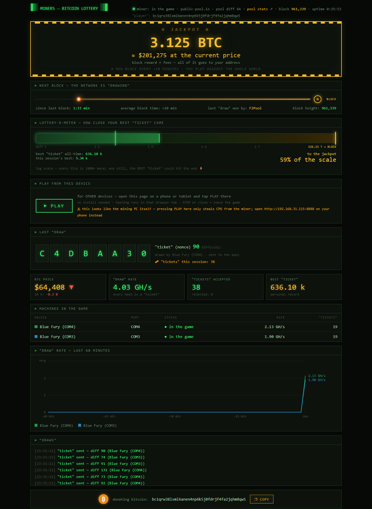

# MINERS — Bitcoin Lottery ⛏🎰

**A pure-Python solo ("lottery") Bitcoin miner for retro USB ASIC sticks from 2013,
with a retro-CRT web dashboard.** No binaries. No dependencies except `pyserial`.
Every line of code is readable — because you should never run mining software you
can't read (see the warning below).

> A 2013 Blue Fury stick does ~2.6 GH/s. The Bitcoin network does ~1,000,000,000 GH/s.
> You will (almost certainly) never find a block. That's not the point. The point is:
> your ticket is real, the drawing happens every ~10 minutes, and somebody always wins.
> While you play, you live. 🙂



## Supported hardware

| Device | Chip / protocol | Speed | Status |
|---|---|---|---|
| Blue Fury / Red Fury (BF1) | Bitfury, binary protocol | ~2.6 GH/s | ✅ mining, multi-stick + hotplug |
| Butterfly Labs Jalapeño (BFLSC) | 2× BFL SC, text protocol | ~4.5–5.3 GH/s | ✅ mining, hotplug, temp watch |
| Bi•Fury (BXF) | 2× Bitfury, text protocol | ~5 GH/s | identification branch only |

**Got an old stick in a drawer?** → **[Does my old USB Bitcoin miner still work?](HARDWARE.md)**
— what is supported, what is not (yet), how to find out which device you have, and
the fixes for every way we have seen one refuse to start.

## Quick start (Windows)

1. Install Python 3.10+ **from python.org only** and `pip install pyserial`
   (or use the portable package — Python included, nothing to install).
2. Double-click **`START_MINING.bat`** (or run `python -u miner.py`) once —
   it creates **`config.json`**. Edit it and set `btc_address` to **your own**
   Bitcoin address, then start it again.
3. Double-click **`dashboard.html`** — the Bitcoin Lottery dashboard opens with
   live data from your miner, plus live block height and BTC price.
   From your phone: `http://<PC-IP>:8888`.

The default pool is [public-pool.io](https://web.public-pool.io) (solo mode, no
registration — your address is your account). Sticks hot-plug: plug one in at any
time and it joins the game in ~5 seconds.

## No ASIC stick? Your CPU can play too 🎟

`cpu_mining` is **on by default**: the miner spawns one worker per CPU core
(minus one, so your computer stays usable) and every hash it computes is a
genuine lottery ticket submitted under the worker name `.cpu`. A CPU does
~1–3 MH/s in pure Python — about a thousand times slower than a stick, and the
stick is already hopeless against the network. **That is the point of a lottery:
somebody wins every ~10 minutes, and your ticket is real.**

## Any phone, tablet or PC can join — just press ▶ PLAY 📱

Open the dashboard on **any device on your network** (`http://<PC-IP>:8888`) and press
**▶ PLAY**. That device starts hashing in the browser tab — no app, no install, works
on Android and iPhone alike — and shows up in *Machines in the game* as
`Browser (Android)`, `Browser (iOS)`, … Press **■ STOP** (or close the tab) to leave.

How it works: the miner hands out nonce stripes at `/work`, the page hashes them with
its own SHA-256 implementation (~0.3–1 MH/s per device; validated against historical
block 125552) and reports candidates to `/submit`, which verifies every one before
submitting it to the pool. Set `browser_mining` to `false` in `config.json` to disable.

`config.json` options:

| Key | Default | Meaning |
|---|---|---|
| `btc_address` | `""` (empty) | **required** — your own address; the miner refuses to start without it |
| `worker_name` | `sticks` | worker suffix for the USB sticks |
| `cpu_mining` | `true` | let your CPU play |
| `cpu_workers` | `0` | 0 = auto (cores − 1); set a number to limit heat/noise |
| `cpu_suggest_difficulty` | `1` | share difficulty asked for the CPU/browser connection |
| `browser_mining` | `true` | allow phones/PCs to join via the dashboard's PLAY button |
| `suggest_difficulty` | `256` | share difficulty asked for the sticks |
| `dashboard_port` | `8888` | the dashboard/stats web port |

## FAQ (the honest basics)

- **Antivirus?** Unlike the 2013 days of shady EXE downloads, this is readable
  Python — Windows Defender stays calm and **you should never disable it**. If an
  AV heuristically flags "mining behaviour", add an exception for the folder.
- **PLAY on the mining PC itself?** Harmless but pointless — it steals CPU from
  the miner. PLAY is for *other* devices.
- **Phone can't connect?** Same Wi-Fi as the PC (not mobile data), `http://` not
  `https://`, allow python.exe in the firewall, and don't port-forward 8888 to
  the internet (the dashboard has no password — home network only).
- **Wallet safety:** the miner knows only your *public* address — no keys, no
  seed. It can (theoretically) win; it can never spend.
- **Stop mining:** close the black window. That's all.

A beginner-friendly step-by-step version of all of this lives in the portable
package as `README.txt`.

## ⚠️ Warning: fake mining binaries

The classic software for these sticks (bfgminer/cgminer) is long unmaintained and
its old Windows builds circulate on sketchy sites — **many of them are malware**.
This project exists partly because its author downloaded a fake "BFGMiner.zip"
that was a trojan. Rules we follow, and you should too:

- **Never download mining binaries** from forums or file-hosting sites.
- Reference protocol knowledge comes from **reading the official sources**
  ([luke-jr/bfgminer](https://github.com/luke-jr/bfgminer),
  [ckolivas/cgminer](https://github.com/ckolivas/cgminer)) — reading, not running.
- Everything executed here is plain Python you can audit yourself.

## Old Zadig/WinUSB drivers (stick shows up but has no COM port)

If you ever used Zadig-era mining tools, your stick may be bound to a WinUSB
driver ("Bitfury BF1" in Device Manager, no COM port, invisible to this miner).
Fix (as Administrator, then replug the stick):

```
pnputil /delete-driver oemXX.inf /uninstall /force
```

where `oemXX.inf` is the libwdi driver shown in the stick's driver details.
Windows then binds the stock `usbser` driver and a COM port appears.

## Hardware tips learned the hard way

- A stick can **enumerate through a bad USB cable and still be mute** (0 frames).
  Always try a direct port before blaming the stick.
- Old sticks wedge occasionally; a physical replug fixes them. A powered USB hub
  with **per-port switches** is a luxury worth having.
- The Jalapeño needs its own 12 V / ≥5 A PSU (barrel 5.5/2.5 mm, center-positive).
  Never feed it 13 V "close enough" adapters.
- Laptops suspend USB to save power, which silently kills a stick until you
  replug it. Run `NOTEBOOK_FIX_USB.bat` as Administrator once (it disables USB
  selective suspend, stops Windows powering down USB hubs, and keeps the machine
  awake with the lid closed), then reboot. Every change it makes is reversible —
  the undo commands are in the file.

## Files

| File | Purpose |
|---|---|
| `miner.py` | the miner: Stratum V1 client, BF1 + BFLSC (Jalapeño) drivers, CPU + browser mining, watchdog, dashboard server |
| `bitfury.py` | BF1 protocol core: SHA-256 midstate, decnonce, block-125552 self-test |
| `jalapeno_test.py` | BFLSC (Jalapeño) known-block self-test |
| `identify.py` | identify connected sticks |
| `dashboard.html` | the Bitcoin Lottery dashboard (works double-clicked or served at `:8888`) |
| `START_MINING.bat` | double-click launcher (logs to `miner.log`) |
| `NOTEBOOK_FIX_USB.bat` | one-off laptop fix: stop Windows suspending your USB miners |
| `lottery_best.json` | your best "ticket" ever (persistent) |

## License

GPLv3 — see [LICENSE](LICENSE). Protocol knowledge was learned by reading
bfgminer/cgminer (GPLv3); this implementation is original code in their spirit.

Powered by inspiration from [Proof of Forge](https://proofofforge.com/).

Donating bitcoin: `bc1qrw38lsml6anen4np6k5j0fdrjf4fa2jqhm8qw5`
